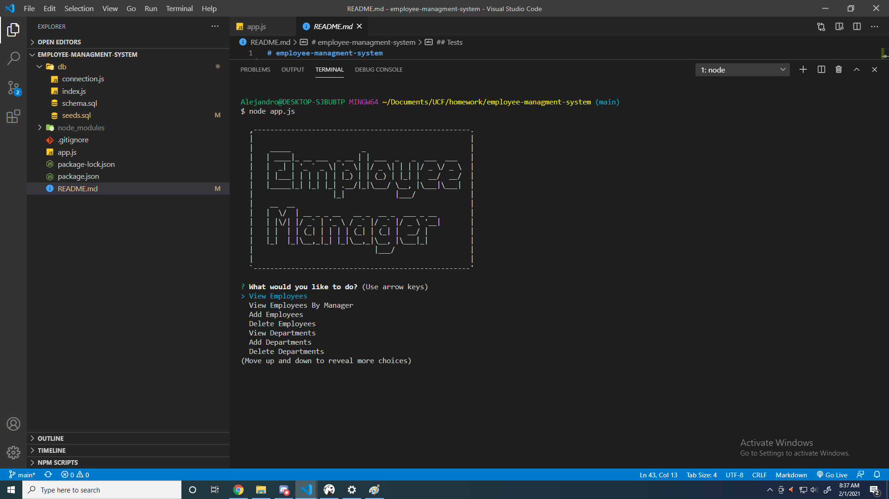

# employee-managment-system

## Description

The application allows the user to keep provide concurrent employee information. The purpose of the assignment was to demonstrate the use of  node.js and mySQL, while implementing CRUD to render an informational system companies can use for employees through a command line applications.

## Table of Contents 
* [Installation](#installation)
​
* [Usage](#usage)
​
* [License](#license)
​
* [Contributing](#contributing)
​
* [Tests](#tests)
​
* [Questions](#questions)
​
## Installation

​To install necessary dependecies please use the following commands:

	npm i 
	
## Usage

	To run with either nodemon or node.js use the folliwng:
	nodemon app.js || node app.js 
​​
## License
MIT
	

## Contributing
​
You may not contribute to the repo at this time.
​
## Tests

    npm test

## Preview

## Questions
​
If you have any questions, comments, or concerns please feel free to contact me at castroal96@gmail.com or on Github: [CastroAlejandro](https://github.com/CastroAlejandro).

